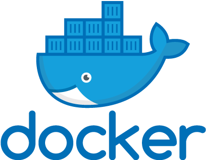

# Docker คืออะไรและดียังไง
Docker คือสิ่งที่มาช่วยชีวิตเหล่า Developer โดยทำให้วงจรในการพัฒนาแอพง่ายขึ้น และช่วยลดคำพูดที่คุ้นหูว่า `"ทำไมมันทำงานไม่ได้ฟระ ทั้งๆที่ในเครื่องผมยังทำงานได้อยู่เลย"` (คุ้นปะ)

> **ตัวอย่างปลากรอบ**  
สมมุติว่าเราต้องไปเขียนเว็บซักตัวที่เป็นภาษา php เราต้องทำอะไรบ้าง? ลง webserver? ลง mySQL? ตั้งค่าเซิฟเวอร์ต่างๆ บลาๆๆๆ ... ซึ่งถ้าไม่ทำของพวกนี้ก็ run php ไม่ได้ใช่ปะ? และขั้นตอนที่ว่ามาทั้งหมดมันก็อยู่กับ**เครื่องเราเอง**เท่านั้น ซึ่งถ้าเราเอาเว็บที่เขียนไปใส่ในเซิฟเวอร์ แต่ลืมตั้งค่าเซิฟเวอร์ให้เหมือนเครื่องเราละ? หรือเวอร์ชั่นของ php ในเครื่องกับเซิฟเวอร์ไม่ตรงกันละ? มันจะทำงานได้ปะ? แล้วถ้าเราทำงานกับเพื่อนๆ เรากับเพื่อนก็ต้องตั้งค่าต่างๆให้เหมือนกันอีกนะ! ถ้ามีคนไปเปลี่ยนก็ต้องบอกให้ทุกคนเปลี่ยนตามกันด้วย!!  
เห็นมะแค่เกริ่นก็ปวดกบาลละ แต่ทั้งหมดนี่ถ้าเราใช้ docker ปัญหาที่ว่ามาจะหมดไป! (บร๊ะ...เหมือนโฆษณาหลอกขายเลย)

# Docker ทำงานยังไง?
โดยปรกติเวลาที่เราจะเขียนแอพอะไรซักอย่าง (เช่นเว็บ php ด้านบน) เราก็ต้องไป setup environment ต่างๆใช่มะ (เช่นติดตั้ง webserver, mySQL, configuration, บลาๆ) ซึ่งขั้นตอนทั้งหมดนี้เราก็จะเขียนเป็นคำสั่งไว้ ซึ่งเราเรียกมันว่า **`Image`** ซึ่งพอเราเอาเว็บของเราไปขึ้นที่เซิฟเวอร์ เราก็จะใช้เจ้า **image** ของเราไปสร้าง environment ที่เหมือนกันเครื่องเราบนเซิฟเวอร์ด้วย มันเลยทำให้เซิฟเวอร์ตัวนั้นทำงานเหมือนกันเครื่องเรา เลยทำให้คำพูดที่ว่า "ทำไมมันทำงานไม่ได้ฟระ ทั้งๆที่ในเครื่องผมยังทำงานได้อยู่เลย" หายไป เพราะการตั้งค่าของเครื่องเราตรงกับเซิฟเวอร์ทุกอย่าง และไม่ใช่แค่เซิฟเวอร์เท่านั้น เพื่อนๆคนไหนต้องการทำงานกับเราก็แค่เอา image ตั้วนั้นไปใช้ ก็จะได้ environment แบบเดียวกันด้วยนั่นเอง

โดยสรุป **`Image`** คือชุดคำสั่งของ docker ที่เอาไว้สร้าง environment ในแบบที่เราต้องการ รวมถึงการตั้งค่าต่างๆ library ที่เราต้องการ และ source code พื้นฐานที่เราอยากให้มันมี (ทั้งหมดนี่อยู่ในสิ่งที่เรียกว่า Image)

เมื่อเรานำ **image** มา run แล้วเราจะได้สิ่งที่เรียกว่า **`Container`** (จินตนาการง่ายๆว่ามันไปสร้างอะไรซักอย่างที่มี environment เหมือนกับที่ image กำหนดไว้ให้เราไง) ซึ่งเจ้า image 1 ตัว เราจะให้มันไปสร้าง container กี่ตัวก็ได้

**ลงรายละเอียดของ Container อีกนิดหน่อย** (ถ้าอ่านแล้ว งง ข้ามไปดูหัวข้อถัดไปโลด)  
การทำงานจริงๆของ Docker จะคล้ายๆกับการไปสร้าง Virtual Machine (VM) แต่จุดที่ต่างกันคือ เวลาที่เราจะไปสร้าง VM มันจะต้องทำงานผ่าน Hypervisor (Hyper-V) ซึ่งมันจะไปสร้าง Guest OS ออกมาแล้วเราถึงจะใช้งานได้ แต่สำหรับ Container มันจะง่ายกว่านั้น หรือพูดง่ายๆว่ามันเบากว่า VM นั่นเอง


# ลองติดตั้ง Docker ดู
ก็ไปโหลดมาสิครับรอไร? ที่ลิงค์หลักของเขา [Docker](https://docs.docker.com/docker-for-windows/install) เมื่อติดตั้งเสร็จเขาจะให้เรา restart com 1 ที พอ restart เสร็จให้เราเปิด command prompt หรือ terminal ขึ้นมา แล้วลองพิมพ์คำสั่งนี้ลงไป
```
docker --version
```
> ถ้าติดตั้งสมบูรณ์เราจะสามารถใช้คำสั่งนี้แล้วเห็นเลขเวอร์ชั่นได้ประมาณนี้ `Docker version 18.09.2, build 6247962` (ตัวเลขไม่เหมือนผมไม่เป็นไรนะจุ๊)

# ลองเขียนเว็บ php ดู
คราวนี้เราจะลองสร้างเว็บ php ซักตัว โดยที่เครื่องเราไม่จำเป็นต้องติดตั้ง webserver เลย!! (ผมชอบมากเพราะขี้เกียจลง webserver มันรกเครื่อง)

สมมุติว่าเราทำงานอยู่ที่ `c:\docker` นะ แล้วทำตามขั้นตอนด้านล่างนี้เลย  
1.สร้างไฟล์ `index.php` ขึ้นมา และเขียนโค๊ดด้านในเป็น
```
<?php
    echo "9 + 5 = ";
    echo 9 + 5;
?>
```
2.สร้างไฟล์ `Dockerfile` ขึ้นมาและเขียนโค๊ดด้านในเป็น
```
FROM php:7.0-apache
COPY . /var/www/html
EXPOSE 80
```
3.เปิด command prompt/terminal ให้มาอยู่ที่ `c:\docker`  
4.พิมพ์ 2 คำสั่งนี้ลงไป
```
docker build -t php-img .
docker run -d -p 80:80 --name phpapp php-img
```
5.เปิด web browser ขึ้นมาแล้วพิมพ์ [http://localhost](http://localhost) แล้วจะเห็นผลลัพท์ว่า
```
9 + 5 = 14
```
> **อธิบายการทำงาน**  
จากขั้นตอนที่ (1) เราสร้างไฟล์ `index.php` ไว้เพื่อเตียมหน้าเว็บไซต์ของเรา (โดยปรกติเราจะเปิดไฟล์ php แล้วให้มัน run ตรงๆไม่ได้ มันจะต้องเอาไฟล์นี้ไปวางบน webserver ถึงจะทำงานได้)  
จากขั้นตอนที่ (2) เราสร้างไฟล์ `Dockerfile` โดยกำหนดว่าถ้ามีการสร้าง **Image** จากไฟล์นี้เราจะได้ environment ที่ติดตั้ง php apache version 7 ไว้ และเมื่อ docker เริ่มสร้าง container มันจะ copy ไฟล์ทุกอย่างไปไว้ใน var/www/html ที่อยู่ใน container และสุดท้ายเราจะสามารถเข้าถึงได้ผ่าน port 80  
จากขั้นตอนที่ (4) คำสั่งแรก: เป็นการสร้าง **Image** จากไฟล์ Dockerfile ขึ้นมา และตั้งชื่อ Image นั้นว่า **php-img**  
จากขั้นตอนที่ (4) คำที่สอง: เป็นการนำ Image ไปสร้างเป็น **Container** จาก Image ที่ชื่อว่า php-img และทำการ map port 80 ในเครื่องให้ตรงกับ port 80 ของ container (ทำให้เราสามารถเข้าไปใช้งาน webserver ผ่าน port 80 ใน web browser ได้)

---
กำลังทำต่อเรื่อยๆ ถ้าใจร้อนไปดูวีดีโอคอร์สอื่นๆรอได้ที่ [Saladpuk.com](http://saladpuk.com)

เจอตรงไหนผิดพลาด หรืออยากช่วยเขียน รบกวน fork + pull request เข้ามานะครับ

# คำสั่ง Docker เบื้องต้น

# [Images](https://docs.docker.com/glossary/?term=image)
An image is an executable package that includes everything needed to run an application--the code, a runtime, libraries, environment variables, and configuration files.

**Pull an image**
```
docker pull <image_name>
```
**List all images**
```
docker images -a  
```
**Remove an image**
```
docker image rm <image_name_or_id>
```
**Create new image**
```
docker build -t <new_image_name> .
```
**Run an image**
```
docker run -p 80:80 <image_name>
```
```
docker run -p 80:80 --name <new_ps_name> <image_name>
```

# [Containers](https://docs.docker.com/glossary/?term=container)
A container is a runtime instance of an image--what the image becomes in memory when executed.

**List containers**
```
docker ps -a  
```
**Start/Stop a running container**
```
docker stop <container_name_or_id>
docker start <container_name_or_id>
```
```
docker stop $(docker ps -a -q)
```
**Remove a container**
```
docker rm <container_name_or_id>
```
```
docker rm $(docker ps -a -q)
```

# System
**Show docker disk usage**
```
docker system df
```
**Remove unused data**
```
docker system prune -a
```

# [Dockerfile](https://docs.docker.com/glossary/?term=Dockerfile)
A Dockerfile is a text document that contains all the commands you would normally execute manually in order to build a Docker image.

**Sample: php7 apache, map to port 80**
```
FROM php:7.0-apache
COPY src/ /var/www/html
EXPOSE 80
```
> Dockerfile

# [Docker compose](https://docs.docker.com/glossary/?term=Compose)
Compose is a tool for defining and running complex applications with Docker. With Compose, you define a multi-container application in a single file, then spin your application up in a single command which does everything that needs to be done to get it running.

```
version: '3.1'

services:
  <name>:
    image: <image_name>
    
  database:
    image: redis
```
> docker-compose.yml

**Version**
```
docker-compose -v
```
**Validation**
```
docker-compose config
```
**Builds and attaches to container for service**
```
docker-compose -f stack.yml up
docker-compose up -d
docker-compose up -d --scale <name>=<number_of_instances>
```
